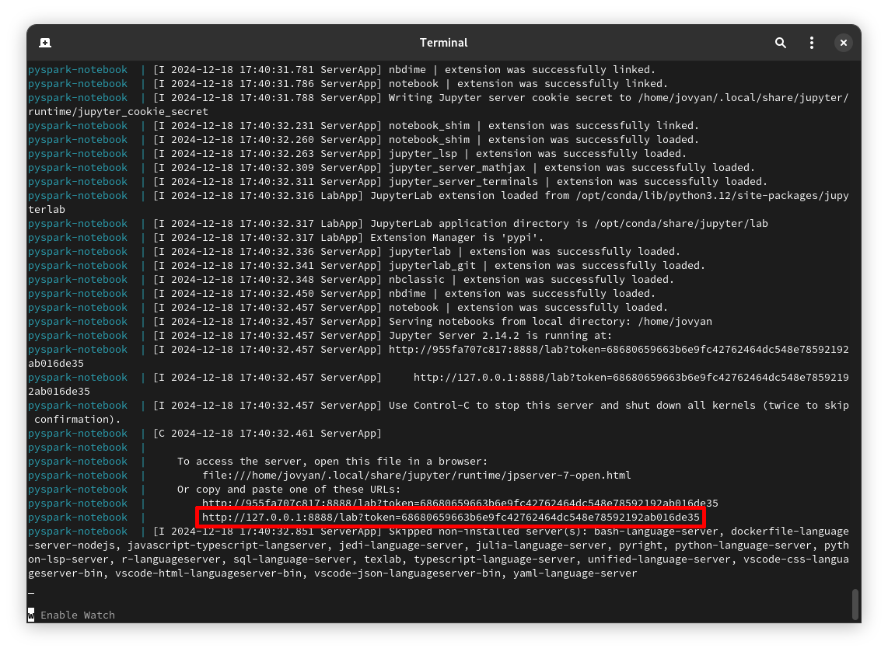
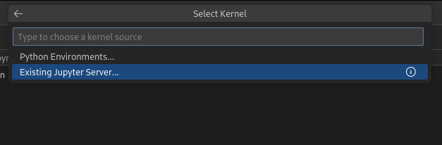
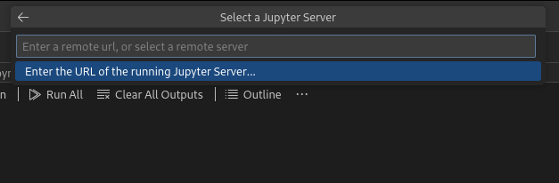
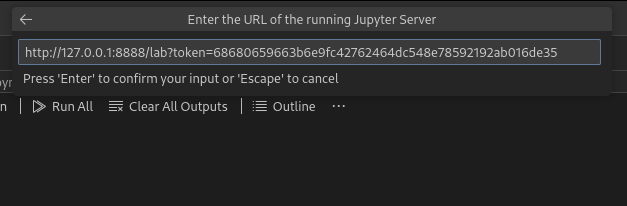
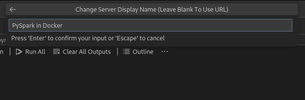
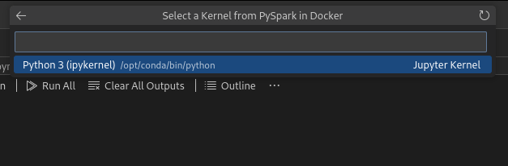
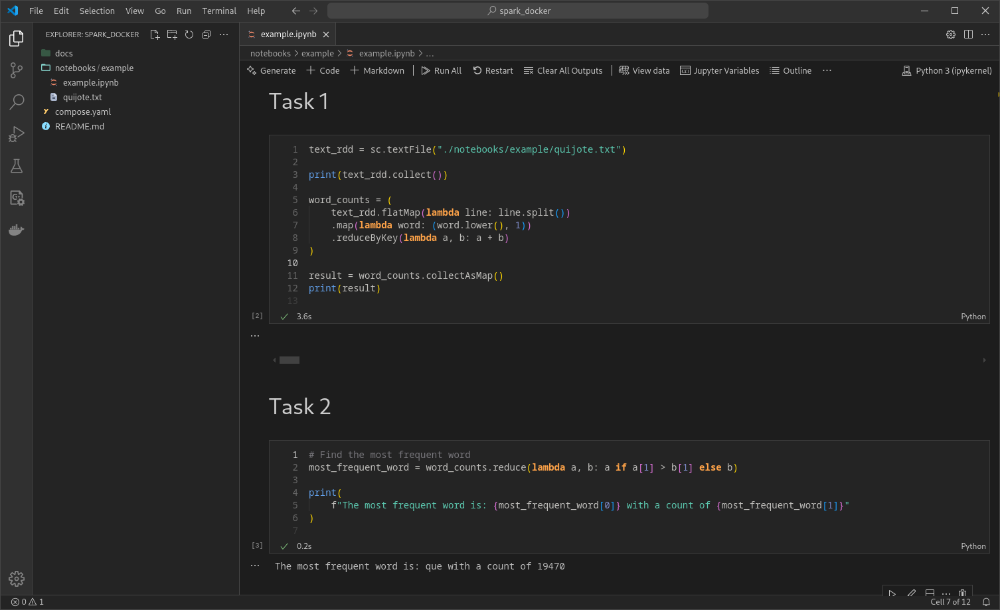

# Spark with PySpark and JupyterLab

This guide provides a Docker Compose configuration for running PySpark alongside JupyterLab.

## Starting the Environment

To start the container, run: `docker compose up`. The `notebooks` directory is mounted in the container, allowing you to access and save notebooks on your local machine.

The **JupyterLab** is available at [http://localhost:8888](http://localhost:8888).

The **Spark UI** is available at [http://localhost:4040](http://localhost:4040) after a Spark job is initiated.

The **JupyterLab token** is displayed in the logs of the JupyterLab container.

## Using the Environment in VS Code

To integrate this setup with **Visual Studio Code**, follow these steps:

1. Open the root folder in VS Code and navigate to the `notebooks` directory.
2. Create a new Jupyter Notebook. In the top-right corner, use the **Select Kernel** option.
3. From the top menu, choose **Existing Jupyter Server…**

 

4. Select **Enter the URL of the running Jupyter Server…**

 

5. Input the server URL: [http://127.0.0.1:8888](http://127.0.0.1:8888), along with the token.

 

6. Assign a custom display name for the server if desired.

 

7. Choose **Python3 (ipykernel)** as the kernel.

 

8. You can now run cells of your notebook and interact with the Jupyter server.

